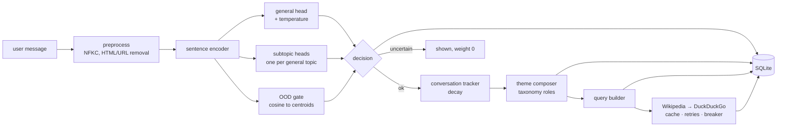

# ContextLens

**Conversation-aware topic analysis for English text, with calibrated
confidence, an "I'm not sure" answer, a running conversation theme, key-less
web search and a local SQLite history.**

```
$ python project.py
ContextLens - English conversation topic analysis
Model ready (v1.0.0, …s).
Enter text (or 'help'): Quantum processors can speed up certain algorithms by using qubits.

[Text analysis]
General topic : Technology
Confidence    : …
Subtopics     :
  - Technology > Quantum Computing (…)
…
```

The full, real output of a three-message conversation is in
[§14 Example output](#14-example-output).

---

## 1. Purpose

For every message a user types, ContextLens

1. predicts the **general topic** (8 classes) and the **subtopics** (28, multi-label,
   organised under the general topics) with **calibrated probabilities**;
2. answers **uncertain** instead of guessing when the text is outside the
   taxonomy ("I'm going to order pizza tonight") or the model is not confident;
3. keeps a **conversation context** in which older messages fade out
   (exponential decay) and composes the active topics into one theme —
   Books + Science → *science books*; + Biology → *science books about biology*;
   Books + History → *history books*;
4. turns the theme into a **search query**, searches **Wikipedia** (DuckDuckGo as
   fallback, no API keys) and shows the top results;
5. stores **messages, predictions, themes, queries and results** in SQLite, so
   `history` works and nothing is lost on `reset`.

Everything — data, input, output, documentation — is English.

## 2. Features

| area | what it does | where |
|---|---|---|
| classification | general topic + hierarchical multi-label subtopics, temperature-scaled probabilities, validation-tuned subtopic threshold | `contextlens/models/` |
| uncertainty | out-of-taxonomy gate (cosine to class centroids) + minimum confidence; uninformative input (symbols, stop words only) is not a turn | `topic_model.py` |
| conversation | decayed topic scores, uncertain turns carry no weight, `reset` starts a new context | `services/tracker.py` |
| theme composition | driven by taxonomy metadata (format / domain / perspective roles), no hard-coded pairs | `services/composer.py`, `configs/taxonomy.json` |
| search | privacy-preserving query (theme phrase + at most two public-vocabulary words), Wikipedia → DuckDuckGo fallback, 72 h cache, retries with back-off, circuit breaker, HTTPS allow-list | `services/query.py`, `services/websearch.py` |
| storage | SQLite with foreign keys, indexes, transactions, parameterised SQL, `PRAGMA user_version` migrations, model version on every prediction; a database error never crashes a turn | `database/db.py` |
| safety | model artifact loaded with skops type allow-list + SHA-256 checksums + encoder fingerprint; never retrained at start-up | `models/artifact.py` |
| reproducibility | `RANDOM_SEED = 42`, every dataset/model pinned by revision, committed label manifest and passages | `contextlens/config.py`, `data/` |

## 3. Architecture



Details, the sequence of one turn and the database schema:
[docs/architecture.md](docs/architecture.md). CLI, settings and Python API:
[docs/api.md](docs/api.md).

## 4. Dataset

No existing labelled dataset covers the brief's taxonomy: of nine candidates
(Hugging Face Hub, Kaggle, UCI — five measured at pinned revisions) the best
covers 3 of 8 general topics and 6 of 28 subtopics
([docs/DATASET_RESEARCH.md](docs/DATASET_RESEARCH.md)). The training corpus was
therefore **built from English Wikipedia**:

| | |
|---|---|
| source | English Wikipedia text (`wikimedia/wikipedia` 20231101.en, fallback `legacy-datasets/wikipedia` 20220301.en — both pinned) labelled through Wikipedia's own **category graph** (DBpedia SPARQL) from curated seed categories |
| size | **42,942 passages** from **11,073 articles** (train 30,051 · val 6,464 · test 6,427), split by article (grouped, stratified) |
| labels | 8 general topics (imbalance ratio 1.59), 28 subtopics (3.81), 6.2% of passages carry 2–3 subtopics; one label rule fixed after error analysis (136 quantum articles, [DATASET_CARD §9](docs/DATASET_CARD.md)) |
| label quality | manual audit of 48 training passages: 89.6% correct, 6.2% weak passage, 4.2% wrong label |
| leakage | 0 shared articles, 0 exact duplicates, 0 near-duplicates (TF-IDF cosine ≥ 0.9) between splits; acceptance sentences absent |
| external evaluation | **Stack Exchange question titles** (never trained on): 10,124 / 10,087 in-taxonomy + 6,000 / 6,000 off-topic (ext_dev / ext_test); a 25-subtopic set of 1,630 / 1,642 questions |
| out-of-taxonomy | 1,327 Wikipedia passages from 12 unrelated categories (cooking, music, cars, …) |
| licence | Wikipedia CC BY-SA 4.0; Stack Exchange CC BY-SA 4.0 — [THIRD_PARTY_NOTICES.md](THIRD_PARTY_NOTICES.md) |

**Why this data:** it is the only source that covers all 8 × 28 topics in
English, it is reproducible from pinned snapshots, its labels come from a
human-curated structure (the category graph) rather than from us, and it has a
real-question counterpart (Stack Exchange) for measuring how well a model
trained on encyclopedic text transfers to the way people actually type.
Card: [docs/DATASET_CARD.md](docs/DATASET_CARD.md).

## 5. Model

| part | what |
|---|---|
| encoder | **all-MiniLM-L6-v2, fine-tuned** 3 epochs on the training split (general + subtopic heads during fine-tuning), exported without its heads, float16 on disk |
| head | one multinomial logistic regression (C = 8, class-weighted) over the **28 subtopics**; P(general) = sum of its subtopics; temperature T = 1.431 |
| subtopics | best subtopic of the predicted general topic + siblings with P(sub \| general) ≥ 0.40, at most 3 |
| "uncertain" | cosine to the nearest class centroid < 0.705, **or** confidence < 0.50, **or** fewer than 40% known English words |
| conversation | exponentially decayed topic scores (decay 0.7 per message, topics below 20% of the total are dropped), composed into one theme by the taxonomy's rules |

Held-out results (`reports/evaluation.json`, never used for a choice):

| set | accuracy | macro-F1 | weighted-F1 | ECE |
|---|---:|---:|---:|---:|
| Wikipedia test (6,427 passages) | 0.835 | 0.834 | 0.835 | 0.031 |
| Stack Exchange questions (10,087) | 0.775 | 0.756 | 0.773 | 0.067 |

Subtopics: macro-F1 0.647 on Wikipedia, 0.701 on questions (25 labels);
the right subtopic is in the top 3 for 86% of Wikipedia passages.

## 6. Why this model

Eleven models were compared on the same splits (`reports/tables.md`); the
choice was made on Wikipedia validation **and** real Stack Exchange questions
(ext_dev), never on test data. General-topic macro-F1:

| model | Wikipedia val | questions (ext_dev) | ms / text | MB |
|---|---:|---:|---:|---:|
| TF-IDF + logistic regression | 0.793 | 0.595 | 1.6 | 11 |
| TF-IDF + complement naive Bayes | 0.803 | 0.643 | 1.8 | 18 |
| zero-shot NLI (bart-large-mnli) | 0.623 | 0.511 | 2,556 | – |
| MiniLM (frozen) + LR | 0.813 | 0.679 | 14.9 | 91 |
| e5-small (frozen) + LR | 0.823 | 0.743 | 27.1 | 133 |
| mpnet-base (frozen) + LR | 0.836 | 0.737 | 66.7 | 438 |
| **MiniLM fine-tuned** | **0.843** | **0.752** | **13.0** | **91** |

* Lexical models score well on encyclopedia text but lose 15–20 points on
  real questions — they memorise vocabulary.
* Among frozen encoders the largest is best on Wikipedia but not on questions.
* Fine-tuning the smallest encoder beats all of them on both sets and is the
  fastest (numbers from labels v1.0; after the label fix of D-27 it reaches
  0.840 / 0.756).
* A single softmax over the 28 subtopics beat a hierarchical head and
  independent sigmoids for every embedding encoder (E-7, D-23).

The full comparison: [docs/MODEL_REPORT.md](docs/MODEL_REPORT.md) · every experiment:
[docs/EXPERIMENTS.md](docs/EXPERIMENTS.md) · failure modes:
[docs/ERROR_ANALYSIS.md](docs/ERROR_ANALYSIS.md) · model card:
[docs/MODEL_CARD.md](docs/MODEL_CARD.md).

## 7. Installation

Python 3.11, CPU is enough (a GPU is used automatically when present).

```bash
git clone https://github.com/Ozgurisikdamar/Cont.git && cd Cont
python -m venv .venv && . .venv/bin/activate
pip install --index-url https://download.pytorch.org/whl/cpu torch==2.5.1   # CPU build, avoids CUDA wheels
pip install -r requirements.txt                 # runtime + training
pip install -r requirements-dev.txt             # + pytest, ruff, mypy
```

The trained model (`models/contextlens-topic/`, 45 MB: float16 encoder + heads + metadata) is part of the
repository, so the application runs right after installation — nothing is
downloaded or trained at start-up.

## 8. Running

```bash
python project.py                  # interactive
python project.py --no-web         # fully offline (no network request at all)
python project.py --once "Cells carry DNA and living things diversify through evolution."
python project.py --script messages.txt   # one message per line
python project.py --debug          # technical detail to stderr and logs/contextlens.log
```

Settings (database path, decay, search on/off, …) can be changed with
`CONTEXTLENS_<SETTING>` environment variables — list in [docs/api.md §2](docs/api.md).

## 9. Training

```bash
python scripts/download_data.py --all    # corpus + Stack Exchange sets (network, ~20 min, cached)
python scripts/eda.py                    # data report + leakage checks → reports/eda.json
python scripts/run_experiments.py        # benchmark → reports/experiments/*.json
python scripts/finetune_transformer.py --encoder minilm-l6 --export models/finetuned/minilm-l6
python train.py                          # final model → models/contextlens-topic/
python scripts/tune_decay.py             # conversation decay → reports/experiments/decay.json
```

`train.py` reads its hyper-parameters from `configs/model.json`, which records
the benchmark's choice. The data build needs network access; everything it
fetches is cached under `data/raw/`, and the label manifest and passages are
committed (`data/manifest/`, `data/processed/`), so training alone runs offline.
Timings on the reference machine (4 vCPU, no GPU): corpus build ~20 min (network), benchmark about an hour, fine-tuning 30.5 min, `train.py` 3.6 min (`evaluate.py` was not timed separately).

## 10. Evaluation

```bash
python evaluate.py                # all held-out sets → reports/evaluation.json + figures
python scripts/report_tables.py   # benchmark JSON → reports/tables.md
```

`evaluate.py` reports general-topic accuracy / macro-F1 / weighted-F1 /
ECE, per-class reports, confusion matrices, subtopic metrics (macro/micro/
samples F1, Hamming loss, subset accuracy, P@1, R@3), the uncertain gate on
in-domain and off-topic text, breakdowns by source and length, the most
confident errors and latency. Summary of the final run:

| measure | Wikipedia test | Stack Exchange ext_test |
|---|---:|---:|
| general macro-F1 | 0.834 | 0.756 |
| subtopic macro-F1 | 0.647 | 0.701 |
| answered "uncertain" | 6.8% | 9.2% |
| accuracy of the answered ones | 0.868 | 0.812 |
| off-topic texts flagged uncertain | 33.3% (675 passages) | 43.6% (6,000 questions) |
| median latency per message | 19.9 ms (p95 28.3 ms) | |

## 11. Tests

```bash
pytest -q              # offline suite: unit + integration + CLI + data integrity (fake encoder, seconds)
pytest -q -m model     # the trained model: acceptance sentences, OOD, conversation, edge cases
pytest -q -m network   # live Wikipedia / DuckDuckGo
ruff check . && ruff format --check . && mypy contextlens project.py train.py evaluate.py
```

Last full run: **162 passed, 0 failed** (161 offline + model, 1 network); ruff and mypy clean. Full record: [docs/TEST_REPORT.md](docs/TEST_REPORT.md).

## 12. Console commands

| command | effect |
|---|---|
| any text | analyse it, update the conversation theme, search, save |
| `history` | this conversation's messages with their classification and the current theme |
| `reset` | start a new conversation context — **saved records are kept** |
| `help` | list the commands |
| `exit`, `quit`, `q` | leave (Ctrl+C / Ctrl+D also leave cleanly) |

## 13. Database

`contextlens.db` (SQLite, created on first run, `PRAGMA user_version = 1`):

| table | one row per |
|---|---|
| `model_versions` | trained model (name, version, training time, dataset fingerprint, metrics) |
| `sessions` | conversation (a `reset` starts a new one) |
| `texts` | message: text, general topic, confidence, subtopics, all probabilities, status, model version |
| `conversation_topics` | theme after a message: topics with scores, label, phrase, search query |
| `search_results` | result shown to the user: rank, title, summary, URL, source |
| `search_cache` | cached provider response (72 h) |

Foreign keys are enforced, every write is one transaction, SQL is parameterised,
and a locked or unwritable database is reported as a warning — the turn still
completes. Schema with columns: [docs/api.md §5](docs/api.md). The file holds
everything typed, in plain text; delete it to erase history
([docs/SECURITY_PRIVACY.md](docs/SECURITY_PRIVACY.md)).

## 14. Example output

The three test sentences of the brief, one after another (`python project.py`,
web search on; the Wikipedia summaries are shortened here):

```
> I read the novel I borrowed from the library; the author's narration was very fluent.

[Text analysis]
General topic : Books
Confidence    : 92.4%
Subtopics     :
  - Novels (56.0%)

[Conversation]
Theme         : Books > Novels
In words      : novels
Search query  : "novels narration novel"

[Web results]
1. Verse novel (Wikipedia) …
2. Shirley (novel) (Wikipedia) …

> Scientists test their hypotheses using experiments and observation.

General topic : Science        Confidence : 92.0%     Subtopics : Scientific Method (66.3%)
Theme         : Science + Books
In words      : science books
Search query  : "science books hypotheses observation"

> Cells carry DNA and living things diversify through evolution.

General topic : Biology        Confidence : 93.8%     Subtopics : Evolution (45.5%)
Theme         : Biology + Science + Books
In words      : science books about biology
Search query  : "science books about biology cells evolution"
1. Cell (biology) (Wikipedia) …   2. Evolution (Wikipedia) …

> I'm going to order pizza tonight.

General topic : Books
Confidence    : 77.2%
Subtopics     :
  - Novels (94.0%)
Note          : uncertain - far from all training topics (possible out-of-taxonomy input).
                This message was not added to the conversation theme.
```

(The second and third turns are condensed here; the application prints them in
the same block layout as the first.)

## 15. Project layout

```
project.py            console entry point
train.py              train the final model  →  models/contextlens-topic/
evaluate.py           evaluate it            →  reports/evaluation.json
contextlens/          package
  config.py             paths, settings (env overrides), data config, RANDOM_SEED
  taxonomy.py           loads configs/taxonomy.json
  preprocessing/        normalisation, informativeness
  data/                 corpus construction: DBpedia crawl, dump extraction, labels, passages, Stack Exchange
  models/               encoders, heads, TopicModel, artifact I/O, training
  services/             tracker, composer, query builder, web search, conversation pipeline
  database/             SQLite layer with migrations
  evaluation/           metrics, plots
  cli/                  console app
configs/              taxonomy.json (source of truth), model.json (benchmark choice)
scripts/              data download, EDA, label audit, benchmark, fine-tuning, NLI, decay tuning, tables
data/                 manifest/ (labels), processed/ (passages), external/ (Stack Exchange)
models/               contextlens-topic/ (trained artifact)
reports/              every number in the documentation: experiments/, evaluation.json, eda.json, figures/
tests/                unit, integration, acceptance, edge cases, data integrity, live network
docs/                 dataset research & card, taxonomy, architecture, API, experiments, model report & card,
                      error analysis, test report, security review, final report
```

Project management: [CLAUDE.md](CLAUDE.md) (quick reference),
[decisions.md](decisions.md), [sprints.md](sprints.md), [handover.md](handover.md),
[PROJECT_STATE.md](PROJECT_STATE.md), [KNOWN_ISSUES.md](KNOWN_ISSUES.md).

## 16. Known limitations

* **Science** (research, method, history of science) is the weakest class:
  F1 0.661 on Wikipedia and 0.369 on questions — its texts are about other fields.
* Trained on encyclopedia passages: short, conversational messages are harder
  (questions ≤ 7 words: accuracy 0.737).
* Off-topic detection is partial: at the chosen operating point only a third
  (Wikipedia) to a half (questions) of off-topic texts are answered "uncertain".
* English only; other languages are answered "uncertain" when fewer than 40% of
  their words are known English words.
* Labels are distant supervision (manual audit: 4.2% wrong, 6.2% weak).
* Web search depends on free public endpoints that may rate-limit (the app
  falls back and keeps working without results).

All issues with measurements and workarounds: [KNOWN_ISSUES.md](KNOWN_ISSUES.md).

## 17. Future work

- A human-annotated set of real chat messages for the 28 subtopics (the external
  sets are question titles, and three subtopics have no Stack Exchange source).
- Newer Wikipedia snapshot; more seed categories for the weakest subtopics.
- Distilling the encoder further or ONNX export for faster start-up.
- More key-less search providers; per-user option to never send queries.
- Encrypting the local database.
