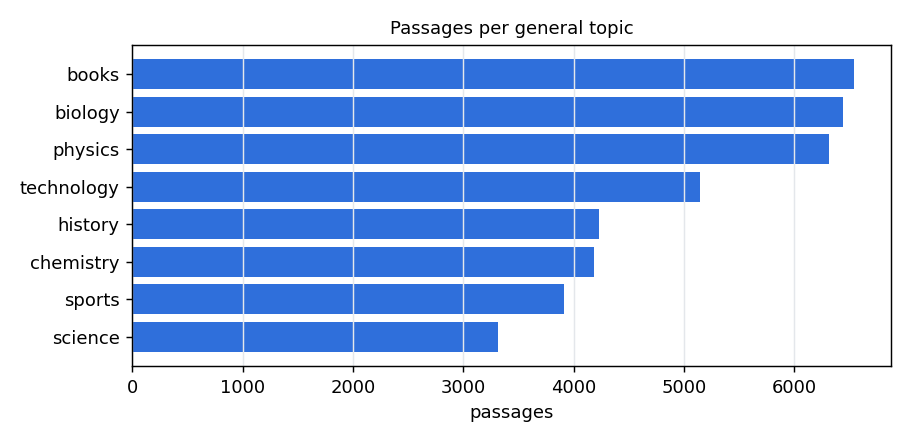
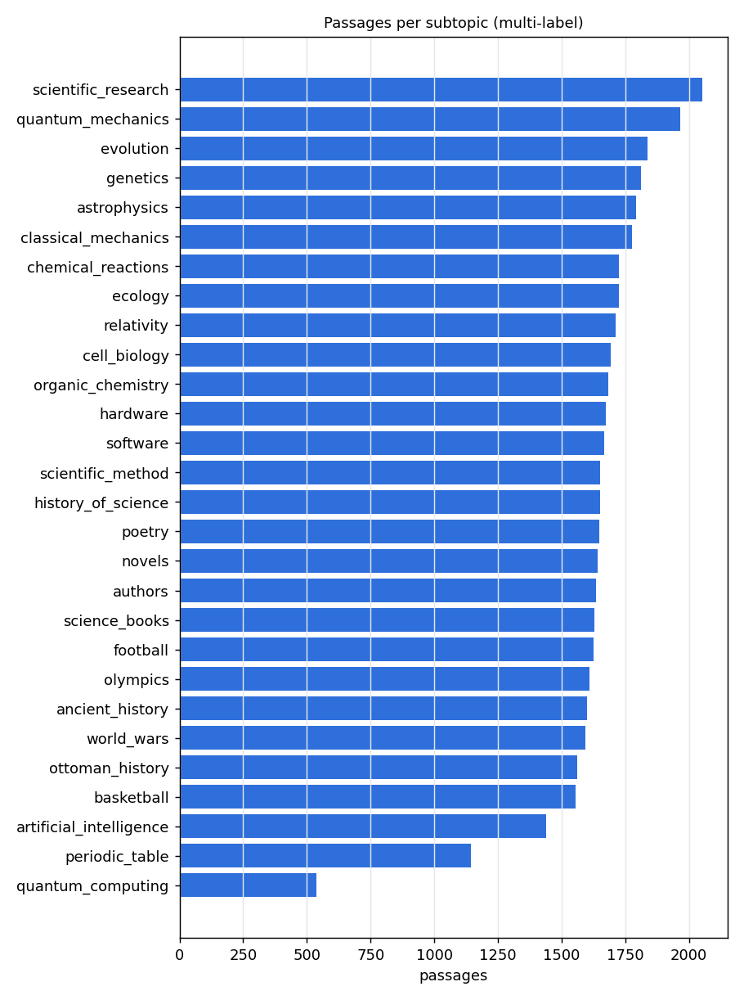
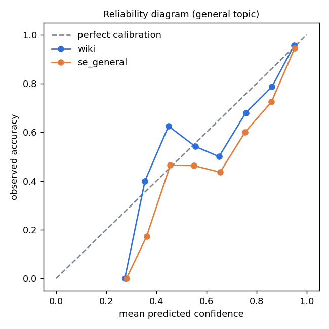
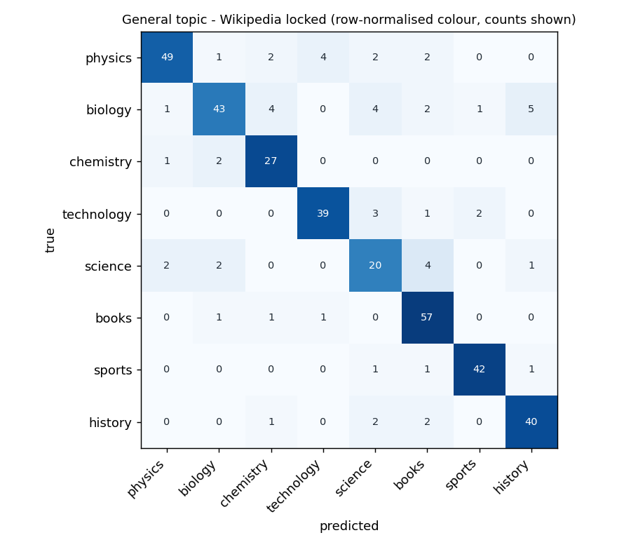
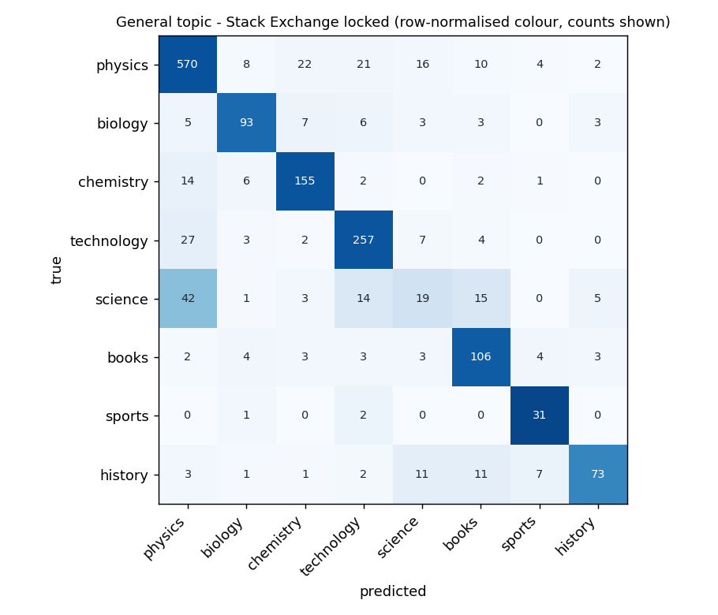
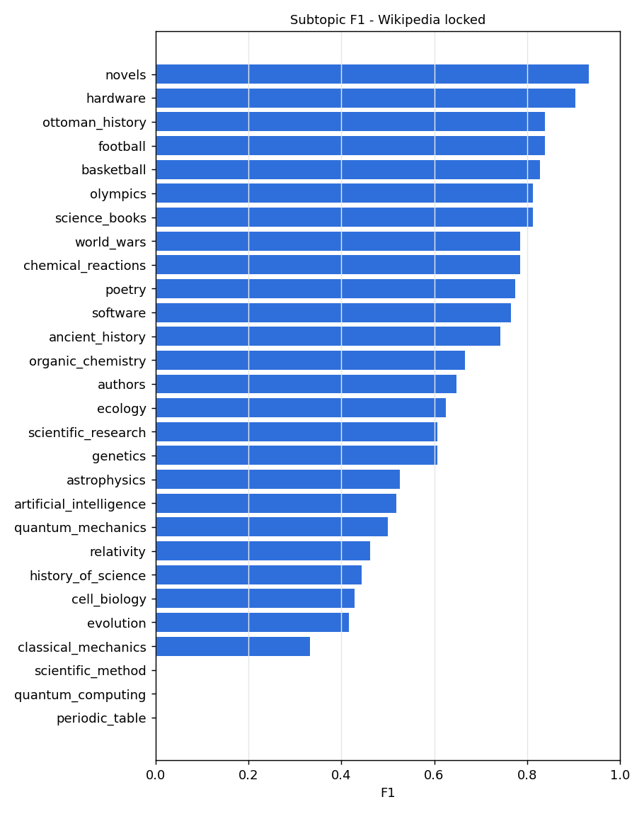

<div align="center">


<br/>


<br/><br/>

<strong>Classify → detect uncertainty → remember context → compose a theme → search → persist.</strong>

<br/><br/>

<table>
<tr>
<td align="center"><strong>8</strong><br/><sub>GENERAL TOPICS</sub></td>
<td align="center"><strong>28</strong><br/><sub>SUBTOPICS</sub></td>
<td align="center"><strong>40,112</strong><br/><sub>TRAINING PASSAGES</sub></td>
<td align="center"><strong>0.838</strong><br/><sub>LOCKED MACRO-F1 (WIKIPEDIA)</sub></td>
<td align="center"><strong>19.9 ms</strong><br/><sub>MEDIAN LATENCY</sub></td>
</tr>
</table>

<p>
<a href="#1-purpose"><b>Purpose</b></a> ·
<a href="#3-architecture"><b>Architecture</b></a> ·
<a href="#4-dataset"><b>Dataset</b></a> ·
<a href="#5-model"><b>Model</b></a> ·
<a href="#10-evaluation"><b>Evaluation</b></a> ·
<a href="#7-installation"><b>Install</b></a>
</p>

</div>

> **ContextLens** is a conversation-aware topic analysis system with calibrated confidence, an explicit **"I'm not sure"** path, a decaying conversation theme, key-less web search and local SQLite history.

<details>
<summary><strong>▶ Quick preview</strong></summary>

```text
$ python project.py
ContextLens - English conversation topic analysis
Model ready (v1.1.0, …s).
Enter text (or 'help'): Quantum processors can speed up certain algorithms by using qubits.

[Text analysis]
General topic : Technology
Confidence    : …
Subtopics     :
  - Quantum Computing (…)
…
```

</details>

The full, real output of a conversation is in [§14 Example output](#14-example-output).

---

## 1. Purpose

For every message a user types, ContextLens

1. predicts the **general topic** (8 classes) and a **primary subtopic** (28,
   organised under the general topics) with **calibrated probabilities**, plus
   **secondary sibling suggestions** when another subtopic of the same general
   topic is also likely;
2. answers **uncertain** instead of guessing when the text is outside the
   taxonomy ("I'm going to order pizza tonight") or the model is not confident,
   and **non_english** when the text is in another language;
3. keeps a **conversation context** in which older messages fade out
   (exponential decay), a one-message tangent does not take over, and a run of
   off-topic messages clears the context; the active topics are composed into
   one theme — Books + Science → *science books*; + Biology → *science books
   about biology*; Books + History → *history books*;
4. turns the theme into a **search query**, searches **Wikipedia** (DuckDuckGo as
   fallback, no API keys) and shows the top results;
5. stores **messages, predictions, themes, queries and results** in SQLite, so
   `history` works and nothing is lost on `reset`.

Everything — data, input, output, documentation — is English.

## 2. Features

| area | what it does | where |
|---|---|---|
| classification | general topic + primary subtopic with sibling suggestions, temperature-scaled probabilities, validation-tuned sibling threshold | `contextlens/models/` |
| uncertainty | off-topic gate (Mahalanobis distance to the general-topic means, calibrated on real questions) + minimum confidence; language gate (fastText lid.176 + training lexicon, per-length thresholds); uninformative input (symbols, stop words only) is not a turn | `topic_model.py`, `ood.py`, `language.py` |
| conversation | decayed topic scores; the dominant topic changes only after two agreeing confident messages; the context expires after four messages without a confident topic; uncertain turns carry no weight; `reset` starts a new context | `services/tracker.py` |
| theme composition | driven by taxonomy metadata (format / domain / perspective roles), no hard-coded pairs | `services/composer.py`, `configs/taxonomy.json` |
| search | privacy-preserving query (theme phrase + at most two public-vocabulary words), Wikipedia → DuckDuckGo fallback, 72 h cache, retries with back-off, circuit breaker, HTTPS allow-list | `services/query.py`, `services/websearch.py` |
| storage | SQLite with foreign keys, indexes, transactions, parameterised SQL, `PRAGMA user_version` migrations, model version on every prediction; a database error never crashes a turn | `database/db.py` |
| safety | model artifact loaded with a skops type allow-list, SHA-256 checksums of every artifact **and encoder** file, encoder fingerprint; never retrained at start-up | `models/artifact.py` |
| evaluation hygiene | development data only for every choice; a **locked holdout** built before any v1.1 decision, fingerprinted by `scripts/freeze.py` and evaluated once | `evaluate.py`, `data/locked/`, `reports/locked/` |
| reproducibility | `RANDOM_SEED = 42`, every dataset/model pinned by revision, committed label manifest and passages | `contextlens/config.py`, `data/` |

## 3. Architecture

```mermaid
%%{init: {"theme":"base","themeVariables":{"fontFamily":"Inter, ui-sans-serif, system-ui","lineColor":"#64748B","primaryTextColor":"#FFFFFF"}}}%%
flowchart LR
    U["💬 User message"] --> P["✨ Preprocess"]
    P --> L{"🌍 Language gate"}
    L -->|"not English"| NE["🚫 non_english<br/>weight = 0"]
    L --> E["🧠 Fine-tuned MiniLM"]

    subgraph INT["INTELLIGENCE"]
      direction TB
      E --> S["28-way subtopic softmax<br/>+ temperature"]
      S --> G["General topic<br/>= sum of children"]
      E --> O["Off-topic gate<br/>Mahalanobis"]
      G --> D{"Decision"}
      O --> D
    end

    D -->|"confident"| T["🧭 Conversation tracker<br/>decay · hysteresis · expiry"]
    D -->|"uncertain"| X["⚠️ Show uncertainty<br/>weight = 0"]

    T --> C["🧩 Theme composer"]
    C --> Q["🔎 Query builder"]
    Q --> W["🌐 Wikipedia<br/>↳ DuckDuckGo fallback"]

    D --> DB[("🗃️ SQLite")]
    C --> DB
    Q --> DB
    W --> DB

    classDef input fill:#0F172A,stroke:#38BDF8,color:#FFFFFF,stroke-width:2px;
    classDef intelligence fill:#312E81,stroke:#818CF8,color:#FFFFFF,stroke-width:2px;
    classDef decision fill:#7C3AED,stroke:#C4B5FD,color:#FFFFFF,stroke-width:2px;
    classDef context fill:#0F766E,stroke:#5EEAD4,color:#FFFFFF,stroke-width:2px;
    classDef retrieval fill:#075985,stroke:#7DD3FC,color:#FFFFFF,stroke-width:2px;
    classDef warn fill:#7C2D12,stroke:#FDBA74,color:#FFFFFF,stroke-width:2px;
    classDef db fill:#111827,stroke:#94A3B8,color:#FFFFFF,stroke-width:2px;

    class U,P input;
    class L,E,G,S,O intelligence;
    class D decision;
    class T,C context;
    class Q,W retrieval;
    class X,NE warn;
    class DB db;
```



Details, the sequence of one turn and the database schema:
[docs/architecture.md](docs/architecture.md). CLI, settings and Python API:
[docs/api.md](docs/api.md).

## 4. Dataset

No existing labelled dataset covers the brief's taxonomy: of nine candidates
(Hugging Face Hub, Kaggle, UCI — five measured at pinned revisions) the best
covers 3 of 8 general topics and 6 of 28 subtopics
([docs/DATASET_RESEARCH.md](docs/DATASET_RESEARCH.md)). The training corpus was
therefore **built from English Wikipedia**:

| | |
|---|---|
| source | English Wikipedia text (`wikimedia/wikipedia` 20231101.en, fallback `legacy-datasets/wikipedia` 20220301.en — both pinned) labelled through Wikipedia's own **category graph** (DBpedia SPARQL) from curated seed categories |
| size | taxonomy **1.2.0**: **40,112 passages** from **10,344 articles**, split by article (grouped, stratified): train 28,075 · val 5,984 · legacy test 6,053 |
| labels | 8 general topics (imbalance ratio 1.97), 28 subtopics (3.67); 5.4% of passages carry 2–3 subtopics; two label-rule revisions after error analysis and audit (quantum seed, D-27; Science redefined as the scientific enterprise, D-32) |
| label quality | stratified audit of **310** passages: 74.5% correct, 20.3% weak, **5.2% wrong [95% CI 3.2, 8.2]**; 7 of the 16 wrong ones removed by category rules |
| leakage | 0 shared articles, 0 exact duplicates, 0 near-duplicates (TF-IDF cosine ≥ 0.9) between splits; acceptance sentences absent |
| development sets | Wikipedia val; **Stack Exchange question titles** ext_dev (10,124 in-taxonomy + 6,000 off-topic; 1,630 subtopic questions); **CLINC150** assistant chat as off-topic text (dev 2,900); **Tatoeba** sentences for the language gate (dev half); 652 out-of-taxonomy Wikipedia passages |
| locked holdout | built before any v1.1 decision, read once: **374** Wikipedia passages from articles never used, **2,713** Stack Exchange questions created in 2026, CLINC150 test (4,350), Tatoeba locked half (`data/locked/MANIFEST.json`) |
| licence | Wikipedia CC BY-SA 4.0; Stack Exchange CC BY-SA 4.0; CLINC150 CC BY 3.0; Tatoeba CC BY 2.0 FR — [THIRD_PARTY_NOTICES.md](THIRD_PARTY_NOTICES.md) |

<div align="center">

### Dataset at a glance

<table>
<tr>
<td width="50%" align="center"></td>
<td width="50%" align="center"></td>
</tr>
<tr>
<td align="center"><sub>General-topic distribution</sub></td>
<td align="center"><sub>Subtopic distribution</sub></td>
</tr>
</table>

</div>

**Why this data:** it is the only source that covers all 8 × 28 topics in
English, it is reproducible from pinned snapshots, its labels come from a
human-curated structure (the category graph) rather than from us, and it has
real-question and chat counterparts for measuring how well a model trained on
encyclopedic text transfers to the way people actually type.
Card: [docs/DATASET_CARD.md](docs/DATASET_CARD.md).

## 5. Model

| part | what |
|---|---|
| encoder | **all-MiniLM-L6-v2, fine-tuned** 3 epochs on the training split (general + subtopic heads during fine-tuning), exported without its heads, float16 on disk |
| head | one multinomial logistic regression (C = 16, class-weighted) over the **28 subtopics**, trained on each passage's primary subtopic; P(general) = sum of its subtopics; temperature T = 1.428 |
| subtopics | the **primary subtopic** (best child of the predicted general topic) + **sibling suggestions** with P(sub \| general) ≥ 0.40, at most 3 in total |
| "uncertain" | Mahalanobis score below the value that keeps 95% of ext_dev questions, **or** confidence < 0.50 |
| "non_english" | fastText lid.176 confident the text is another language (reject confidence 0.5 for 1–2 words, 0.3 for 3+ words), lexicon as a tie-breaker |
| conversation | decay 0.7, theme share ≥ 0.20, dominant topic changes after 2 agreeing confident messages, context expires after 4 messages without a confident topic |

It is **not** a full multi-label classifier: only 6% of the passages carry two
subtopics, and a comparison with one-vs-rest and per-parent sigmoid heads
(D-33) showed that their best operating point also predicts one label.

**Locked holdout** (`reports/locked/results.json`, evaluated once after the
freeze):

| set | n | accuracy | macro-F1 | weighted-F1 | ECE |
|---|---:|---:|---:|---:|---:|
| Wikipedia, unseen articles | 374 | 0.848 | 0.838 | 0.847 | 0.058 |
| Stack Exchange questions (2026) | 1,623 | 0.804 | 0.730 | 0.796 | 0.056 |
| same, without the history-of-science site | 1,524 | 0.843 | 0.818 (7 classes) | – | – |

<div align="center">



<sub>Calibration / reliability of the final model on the locked holdout</sub>

</div>

Subtopics: micro-F1 0.659 on Wikipedia (the right one is in the top 3 for 85%),
0.603 on questions. Off-topic: 78.1% of assistant chat and 48.5% of off-topic
questions answered "uncertain" (AUROC 0.961 / 0.887).

## 6. Why this model

Eleven model families were compared on the same splits (`reports/tables.md`,
taxonomy 1.2.0); the choice was made on Wikipedia validation **and** real Stack
Exchange questions (ext_dev), never on test data. General-topic macro-F1:

| model | Wikipedia val | questions (ext_dev) | ms / text | MB |
|---|---:|---:|---:|---:|
| TF-IDF + logistic regression | 0.805 | 0.593 | 1.5 | 10 |
| TF-IDF + complement naive Bayes | 0.813 | 0.636 | 1.5 | 17 |
| zero-shot NLI (bart-large-mnli, v1.0 sample) | 0.623 | 0.511 | 2,556 | – |
| MiniLM (frozen) + LR | 0.830 | 0.712 | 14.1 | 91 |
| mpnet-base (frozen) + LR | 0.849 | 0.713 | 66.3 | 438 |
| bge-small (frozen) + LR | 0.838 | 0.736 | 27.8 | 133 |
| e5-small (frozen) + LR | 0.842 | 0.747 | 25.3 | 133 |
| **MiniLM fine-tuned** | **0.848** | **0.749** | **13.5** | **91** |

* Lexical models score well on encyclopedia text but lose ~20 points on
  real questions — they memorise vocabulary (training macro-F1 0.94–1.00).
* Among frozen encoders the largest (mpnet-base) is best on Wikipedia but
  among the worst on questions: choosing on Wikipedia alone would pick the
  wrong, slowest model.
* Fine-tuning the smallest encoder is best on questions and ties the best on
  Wikipedia, at the lowest latency and size. The margins are narrower on the
  1.2.0 labels than on v1.0 (where it led on both); the choice made before the
  freeze stands (docs/MODEL_REPORT.md §1).
* One softmax over the 28 subtopics beat hierarchical and one-vs-rest sigmoid
  heads, also on the production encoder (D-23, D-33).

The full comparison: [docs/MODEL_REPORT.md](docs/MODEL_REPORT.md) · every experiment:
[docs/EXPERIMENTS.md](docs/EXPERIMENTS.md) · failure modes:
[docs/ERROR_ANALYSIS.md](docs/ERROR_ANALYSIS.md) · model card:
[docs/MODEL_CARD.md](docs/MODEL_CARD.md).

## 7. Installation

Python 3.11, CPU is enough (a GPU is used automatically when present).

```bash
git clone https://github.com/Ozgurisikdamar/ContexLens.git && cd ContexLens
python -m venv .venv && . .venv/bin/activate
pip install --index-url https://download.pytorch.org/whl/cpu torch==2.5.1   # CPU build, avoids CUDA wheels
pip install -r requirements.txt                 # runtime + training
pip install -r requirements-dev.txt             # + pytest, ruff, mypy
```

The trained model (`models/contextlens-topic/`, 47 MB: float16 encoder, heads,
off-topic detector, fastText language identifier `langid.ftz`, metadata with
SHA-256 checksums) is part of the repository, so the application runs right
after installation — nothing is downloaded or trained at start-up.

## 8. Running

```bash
python project.py                  # interactive
python project.py --no-web         # fully offline (no network request at all)
python project.py --once "Cells carry DNA and living things diversify through evolution."
python project.py --script messages.txt   # one message per line
python project.py --debug          # technical detail to stderr and logs/contextlens.log
```

Settings (database path, decay, expiry, search on/off, …) can be changed with
`CONTEXTLENS_<SETTING>` environment variables — list in [docs/api.md §2](docs/api.md).

## 9. Training

```bash
python scripts/download_data.py --all    # corpus + Stack Exchange sets (network, ~20 min, cached)
python scripts/build_ood_conversational.py   # CLINC150 off-topic chat (train / dev / locked)
python scripts/build_language_eval.py        # Tatoeba language set (dev / locked)
python scripts/eda.py                    # data report + leakage checks → reports/eda.json
python scripts/run_experiments.py        # benchmark → reports/experiments/*.json (dev splits only)
python scripts/finetune_transformer.py --encoder minilm-l6 --export models/finetuned/minilm-l6
python scripts/head_comparison.py        # softmax vs sigmoid heads → head_comparison.json
python scripts/ood_experiment.py         # seven off-topic detectors → ood_detectors.json
python scripts/language_gate_experiment.py
python train.py                          # final model → models/contextlens-topic/
python scripts/tune_decay.py             # conversation tracker → reports/experiments/decay.json
```

`train.py` reads its hyper-parameters from `configs/model.json`, which records
the choices of the experiments. The data build needs network access; everything
it fetches is cached under `data/raw/`, and the label manifest and passages are
committed (`data/manifest/`, `data/processed/`), so training alone runs offline.
Timings on the reference machine (4 vCPU, no GPU): corpus build ~20 min
(network), benchmark ~1.5 h, fine-tuning ~40 min, `train.py` < 1 min with
cached embeddings.

## 10. Evaluation

```bash
python evaluate.py --stage dev      # development data → reports/evaluation_dev.json + figures
python scripts/freeze.py            # fingerprint config, data and artifact → reports/locked/FREEZE.json
python evaluate.py --stage locked   # ONCE: locked holdout → reports/locked/results.json + raw predictions
python scripts/report_tables.py     # benchmark JSON → reports/tables.md, reports/experiment_log.md
```

`evaluate.py` reports general-topic accuracy / macro-F1 / weighted-F1 / ECE,
per-class reports, confusion matrices, subtopic metrics (macro/micro/samples
F1, Hamming loss, subset accuracy, P@1, R@3), the gates on in-domain,
off-topic and non-English text (AUROC, AUPRC, FPR@95TPR, flag rates by rule),
breakdowns by source and length, the most confident errors, latency and the
acceptance probes. `--stage locked` refuses to run without the freeze file or
when anything in the fingerprint changed. Summary of the locked run:

| measure | Wikipedia (374) | questions (1,623) |
|---|---:|---:|
| general macro-F1 | 0.838 | 0.730 (0.818 without hsm) |
| subtopic micro-F1 / P@1 | 0.659 / 0.668 | 0.603 / 0.624 |
| answered "uncertain" | 4.0% | 9.3% |
| accuracy of the answered ones | 0.861 | 0.844 |
| off-topic flagged | – | 48.5% of off-topic questions · 78.1% of CLINC150 chat |
| non-English rejected (Tatoeba) | 48% (1 word) · 76% (2) · 93% (3) · 97% (sentence) | |
| median latency per message | 19.9 ms (p95 30.3 ms) | |

<div align="center">

### Evaluation visuals (locked holdout)

<table>
<tr>
<td width="50%" align="center"></td>
<td width="50%" align="center"></td>
</tr>
<tr>
<td align="center"><sub>Wikipedia, unseen articles</sub></td>
<td align="center"><sub>Stack Exchange questions (2026)</sub></td>
</tr>
</table>



<sub>Per-subtopic F1 on the locked Wikipedia passages</sub>

</div>

The v1.0 `test` / `ext_test` splits were looked at during v1.0 development and
are reported only as a *legacy* section of the locked report.

## 11. Tests

```bash
pytest -q                   # offline suite: unit + integration + CLI + data integrity (fake encoder)
pytest -q -m model          # the trained model: acceptance sentences, off-topic, conversation, edge cases
pytest -q -m network        # resilience: clean status whatever the providers do
pytest -q -m network_live   # live smoke: fails unless a provider returns a valid result
bash scripts/ci.sh          # ruff, format, mypy, offline + model tests (the CI steps)
```

Last full run: **230 passed, 0 failed** (227 offline + model, 1 network resilience, 2 live smoke); ruff and mypy clean. Full record: [docs/TEST_REPORT.md](docs/TEST_REPORT.md).
The GitHub Actions workflow (`.github/workflows/ci.yml`) runs the same steps;
it has a manual trigger only, because Actions does not start on this account
(billing) — see decisions.md D-35.

## 12. Console commands

| command | effect |
|---|---|
| any text | analyse it, update the conversation theme, search, save |
| `history` | this conversation's messages with their classification and the current theme |
| `reset` | start a new conversation context — **saved records are kept** |
| `help` | list the commands |
| `exit`, `quit`, `q` | leave (Ctrl+C / Ctrl+D also leave cleanly) |

## 13. Database

`contextlens.db` (SQLite, created on first run, `PRAGMA user_version = 1`):

| table | one row per |
|---|---|
| `model_versions` | trained model (name, version, training time, dataset fingerprint, metrics) |
| `sessions` | conversation (a `reset` starts a new one) |
| `texts` | message: text, general topic, confidence, subtopics, all probabilities, status, model version |
| `conversation_topics` | theme after a message: topics with scores, label, phrase, search query |
| `search_results` | result shown to the user: rank, title, summary, URL, source |
| `search_cache` | cached provider response (72 h) |

Foreign keys are enforced, every write is one transaction, SQL is parameterised,
and a locked or unwritable database is reported as a warning — the turn still
completes. Schema with columns: [docs/api.md §5](docs/api.md). The file holds
everything typed, in plain text; delete it to erase history
([docs/SECURITY_PRIVACY.md](docs/SECURITY_PRIVACY.md)).

## 14. Example output

The three test sentences of the brief and the off-topic sentence, one after
another (`python project.py --no-web --script …`, model v1.1.0; with web search
on, Wikipedia results follow each block):

```
> I read the novel I borrowed from the library; the author's narration was very fluent.

[Text analysis]
General topic : Books
Confidence    : 93.5%
Subtopics     :
  - Novels (65.7%)

[Conversation]
Theme         : Books > Novels
In words      : novels
Search query  : "novels narration borrowed"

> Scientists test their hypotheses using experiments and observation.

General topic : Science        Confidence : 91.9%     Subtopics : Scientific Method (57.6%)
Theme         : Books + Science
In words      : science books
Search query  : "science books hypotheses experiments"

> Cells carry DNA and living things diversify through evolution.

General topic : Biology        Confidence : 93.1%     Subtopics : Evolution (47.0%)
Theme         : Books + Biology + Science
In words      : science books about biology
Search query  : "science books about biology cells evolution"

> I'm going to order pizza tonight.

[Text analysis]
General topic : Books
Confidence    : 53.0%
Subtopics     :
  - Novels (94.3%)
Note          : uncertain - far from all training topics (possible out-of-taxonomy input).
                This message was not added to the conversation theme.

[Conversation]
Theme         : Books + Biology + Science
In words      : science books about biology
```

(The second and third turns are condensed here; the application prints them in
the same block layout as the first.)

## 15. Project layout

```
project.py            console entry point
train.py              train the final model  →  models/contextlens-topic/
evaluate.py           evaluate it: --stage dev | --stage locked
contextlens/          package
  config.py             paths, settings (env overrides), data config, RANDOM_SEED
  taxonomy.py           loads configs/taxonomy.json
  preprocessing/        normalisation, informativeness
  data/                 corpus construction: DBpedia crawl, dump extraction, labels, passages, Stack Exchange
  models/               encoders, heads, off-topic detectors, language gate, TopicModel, artifact I/O, training
  services/             tracker, composer, query builder, web search, conversation pipeline
  database/             SQLite layer with migrations
  evaluation/           metrics, plots
  cli/                  console app
configs/              taxonomy.json (source of truth), model.json (experiment choices)
scripts/              data build, EDA, label audit, benchmark, fine-tuning, head / off-topic / language
                      experiments, tracker tuning, locked-set build, freeze, tables, ci.sh
data/                 manifest/ (labels), processed/ (passages), external/ (dev sets), locked/ (holdout)
models/               contextlens-topic/ (trained artifact)
reports/              every number in the documentation: experiments/, evaluation_dev.json,
                      locked/ (FREEZE, results, raw predictions), eda.json, label audits, figures/, tests/
tests/                unit, integration, acceptance, edge cases, data integrity, network
docs/                 dataset research & card, taxonomy, architecture, API, experiments, model report & card,
                      error analysis, test report, security review, hardening log, final report
```

Project management: [CLAUDE.md](CLAUDE.md) (quick reference),
[decisions.md](decisions.md), [sprints.md](sprints.md), [handover.md](handover.md),
[PROJECT_STATE.md](PROJECT_STATE.md), [KNOWN_ISSUES.md](KNOWN_ISSUES.md),
[docs/HARDENING.md](docs/HARDENING.md).

## 16. Known limitations

* **Science on real questions** is the weakest point: F1 0.656 on Wikipedia
  but 0.241 on questions — the history-of-science site asks about the history
  of one field (accuracy 0.19; 42% go to Physics).
* **Off-topic detection is partial:** half of off-topic questions and a fifth
  of assistant chat still get a topic; out-of-taxonomy encyclopedia paragraphs
  are caught only about a quarter of the time.
* **Short non-English inputs:** about half of one-word non-English inputs pass
  the language gate.
* **Subtopics are one primary label + suggestions**, not multi-label
  predictions.
* **Labels are distant supervision** (audit: 5.2% wrong, 20.3% weak).
* **Real topic switches are followed one turn later** — the price of not
  following one-message tangents.
* Web search depends on free public endpoints that may rate-limit (the app
  falls back and keeps working without results); CI has no automatic trigger.

All issues with measurements and workarounds: [KNOWN_ISSUES.md](KNOWN_ISSUES.md).

<br/>

---

## 17. Future work

- A human-annotated set of real chat messages (in- and off-topic) for the 28
  subtopics, and an off-topic detector trained on it.
- A second general topic for "history of a field" questions.
- Fine-tuning a larger encoder (e5-small-v2, not run: E-6).
- Newer Wikipedia snapshot; more seed categories for the weakest subtopics.
- ONNX export for faster start-up; encrypting the local database.


<br/>

<div align="center">


<sub><strong>ContextLens</strong> · Context-aware NLP, calibrated uncertainty, local-first history.</sub>

</div>
