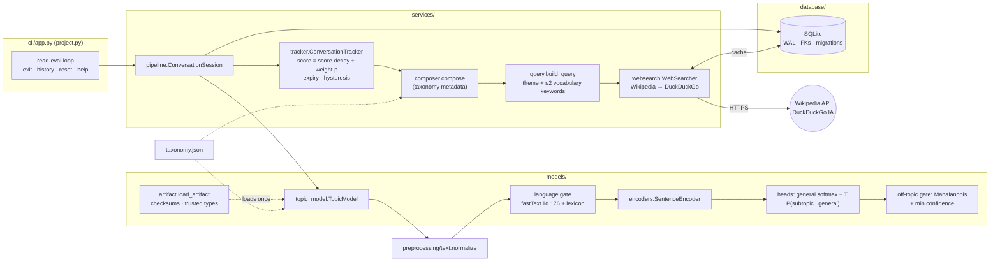
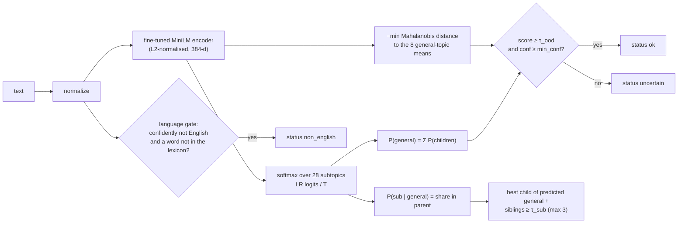
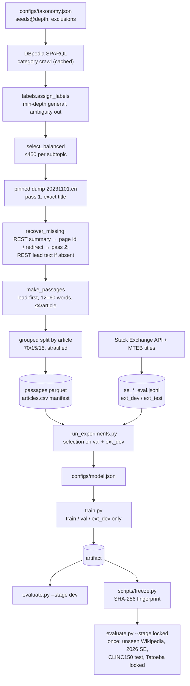
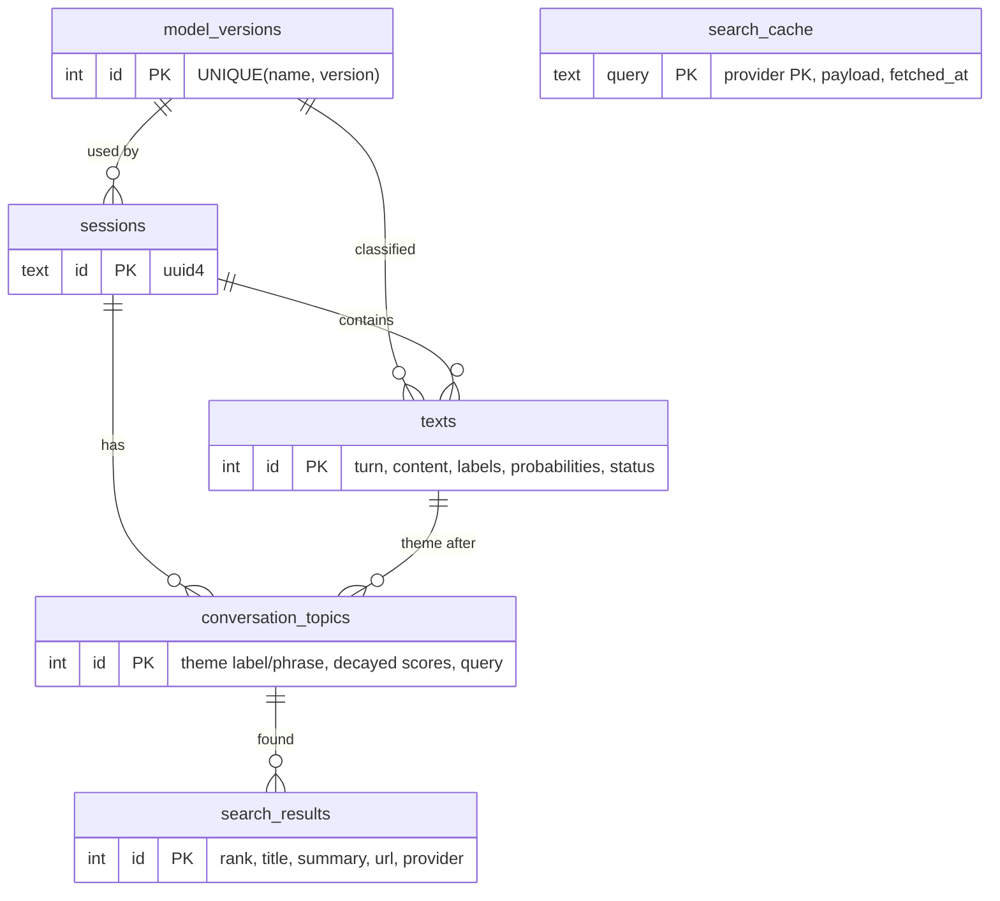

# Architecture

ContextLens is a local, single-process Python application. It has three layers
that can fail independently — **model**, **storage**, **web** — and a
conversation layer that ties them together. Only the model is required: a
database or network failure degrades the output (a warning, no search
results) but never stops classification.

## 1. Components



| module | responsibility | depends on |
|---|---|---|
| `contextlens/config.py` | paths, runtime settings (env overrides `CONTEXTLENS_*`), data pins | — |
| `contextlens/taxonomy.py` | load + validate `configs/taxonomy.json` | — |
| `contextlens/preprocessing/text.py` | normalisation (NFKC, HTML, URLs, mentions, control chars, length cap), informativeness test | — |
| `contextlens/models/encoders.py` | pinned sentence encoders, embedding cache | torch, sentence-transformers |
| `contextlens/models/heads.py` | logistic-regression heads, temperature scaling, hierarchical subtopic heads, subtopic decision rule | scikit-learn |
| `contextlens/models/topic_model.py` | `TopicModel.predict` → `Prediction` (ok / uncertain / non_english / uninformative) | encoders, heads, ood, language |
| `contextlens/models/ood.py` | off-topic detectors (centroid, MSP, energy, Mahalanobis, kNN, binary, "other" class); production uses Mahalanobis (D-34) | scikit-learn |
| `contextlens/models/language.py` | language gate: fastText lid.176 + training lexicon, per-length reject thresholds (D-30) | fasttext |
| `contextlens/models/training.py` | fit heads, tune temperature / threshold / OOD threshold on validation | heads |
| `contextlens/models/artifact.py` | save/load artifact (skops, checksums, encoder manifest, trusted types) | skops |
| `contextlens/services/tracker.py` | decayed conversation scores, context expiry, dominant-topic hysteresis, active topics | — |
| `contextlens/services/composer.py` | active topics → one theme phrase | taxonomy |
| `contextlens/services/query.py` | theme phrase → search query (privacy filter) | — |
| `contextlens/services/websearch.py` | key-less search, fallback, cache, parsing, URL safety | net, database (cache) |
| `contextlens/services/pipeline.py` | one turn end to end, failure isolation | all of the above |
| `contextlens/database/db.py` | schema, migrations, parameterised writes/reads | sqlite3 |
| `contextlens/cli/app.py` | terminal UI, commands, EOF / Ctrl+C handling | pipeline |
| `contextlens/data/*` | offline data acquisition (DBpedia crawl, dump extraction, REST backfill, Stack Exchange) | network — never used at runtime |

## 2. One conversation turn

```mermaid
sequenceDiagram
    participant U as User
    participant C as CLI
    participant S as ConversationSession
    participant M as TopicModel
    participant D as SQLite
    participant T as Tracker+Composer
    participant W as WebSearcher
    U->>C: "Quantum processors can speed up ..."
    C->>S: process(text)
    S->>M: predict(text)
    M-->>S: Prediction(general, conf, subtopics, status, ood_score)
    alt status == uninformative
        S-->>C: nothing to analyse (no turn, nothing stored)
    else ok / uncertain / non_english
        S->>D: INSERT texts (turn, labels, probabilities, status)
        S->>T: update(probs, weight = 0 if uncertain else 1)
        Note over T: 4 turns without a confident topic clear the context;<br/>the dominant topic changes after 2 agreeing messages
        T-->>S: theme label + phrase (+ context_expired)
        S->>W: search([theme+keywords, theme])
        W->>D: cache lookup (TTL 72 h)
        W-->>S: results | offline | no_results
        S->>D: INSERT conversation_topics, search_results
        S-->>C: TurnResult (+ warnings)
    end
    C-->>U: [Text analysis] [Conversation] [Web results]
```

## 3. Model

Production configuration (`configs/model.json`, decisions D-22, D-30, D-33,
D-34): encoder **all-MiniLM-L6-v2 fine-tuned** on the training split, head
type **`flat_softmax`** (primary subtopic + secondary sibling suggestions),
off-topic gate **Mahalanobis**, language gate **fastText lid.176 + lexicon**.



* **Hierarchy is enforced by construction:** P(general) is the sum of its
  subtopics, subtopics are only chosen among the children of the predicted
  general topic, and the joint score is `P(general) · P(subtopic | general)`.
* The alternative `head_type = hierarchical` (separate general LR head + one
  one-vs-rest head per general topic) is still supported and tested. The
  flat softmax, a flat one-vs-rest sigmoid head and the hierarchical sigmoid
  head were compared on development data (D-33): the softmax won, and the
  objective is described as *primary subtopic + secondary sibling
  suggestions*, not true multi-label classification.
* **Calibration:** logits are divided by a temperature fitted on the validation
  split (NLL of the general topic).
* **Thresholds:** subtopic τ_sub on Wikipedia val; off-topic τ_ood keeps 95%
  of Stack Exchange ext_dev questions; min_conf by the coverage rule (D-25).
* **Off-topic gate (D-34):** Mahalanobis distance to the general-topic means
  with a shared Ledoit–Wolf covariance; chosen over centroid cosine, MSP,
  energy, kNN, a binary classifier and an "other" class on development data.
* **Language gate (D-30):** fastText lid.176 identifies the language; a text
  is *non_english* when the identifier is confident (per-length thresholds
  chosen on the Tatoeba dev half) **and** it contains a word outside the
  training lexicon. It runs before the informativeness check, so text in
  another script is never reported as "nothing to analyse".
  All values are stored in the artifact metadata.

### Artifact (`models/contextlens-topic/`)

| file | content |
|---|---|
| `metadata.json` | name, version, training time, dataset fingerprint, encoder, head type, thresholds, temperature, validation and test metrics, min_confidence sweep, encoder fingerprint (probe embedding), SHA-256 of the files below, `encoder_manifest` (path, size, SHA-256 of every encoder file) |
| `heads.skops` | head type + heads + off-topic detector (skops, loaded with an explicit trusted-type allowlist — no pickle) |
| `centroids.npy` | 8 × d class centroids (v1.0 gate; used when no detector is stored) |
| `langid.ftz`, `lexicon.txt` | language identifier and training lexicon (checksummed) |
| `vocabulary.json` | word → IDF from the training split (query keyword filter) |
| `encoder/` | the fine-tuned sentence encoder (float16 safetensors + tokenizer), committed |

`load_artifact` verifies every checksum — including each encoder file against
`encoder_manifest`, refusing missing, changed or extra files — re-encodes a probe sentence to check
the encoder (D-18) and refuses to load a modified or mismatched artifact;
a missing artifact produces an error that says how to build it. The model is
**never retrained at start-up**.

## 4. Data pipeline (offline)



## 5. Storage



* Schema versioning with `PRAGMA user_version` and an ordered migration list.
* `PRAGMA foreign_keys=ON`, `journal_mode=WAL`, `busy_timeout=5000 ms`.
* Every write is one transaction (`with conn:`); every statement is parameterised.
* `reset` ends the session (`ended_at`) and starts a new one — **records are kept**.

## 6. Failure isolation

| failure | behaviour |
|---|---|
| artifact missing / corrupted | CLI exits with code 2 and prints how to build it |
| database locked / unwritable / disk error | classification, tracking and search continue; a warning is shown; `history` falls back to the in-memory log |
| network down, timeout, HTTP 429/5xx | bounded retries with back-off and `Retry-After`; then `status=offline`, no results; cache used when fresh |
| malformed JSON / oversize response | treated as a failed provider; next provider tried |
| empty / symbol-only / stop-word-only input | `uninformative`: not a turn, nothing stored |
| off-topic input | `uncertain`: stored, ages the context, adds no topic, adds no query keywords; 4 in a row clear the context |
| non-English input | `non_english`: stored, handled like an uncertain turn |
| Ctrl+C / EOF | session closed cleanly, exit code 0 |
